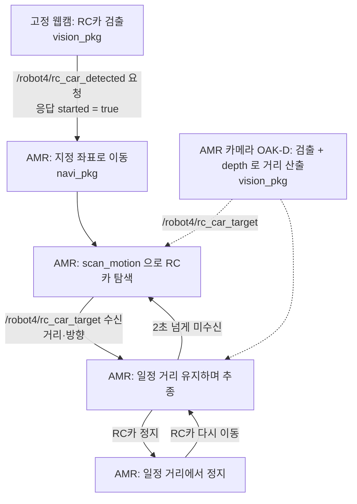

# 인터페이스 정의 (v1.0, 2026-10-06)

`vision_pkg` 와 `navi_pkg` 가 주고받는 토픽·서비스 약속이다. 타입은 `interface_pkg` 의 `msg/`, `srv/` 에 있다.
강의 코드(`to_students` day2·day3)의 방식에 맞췄다. 바꿀 것이 있으면 이 문서를 먼저 고치고 알린다.

## 1. 전체 흐름



## 2. 역할 경계

| 담당 | 하는 일 |
|---|---|
| `vision_pkg` (비전 담당) | **카메라에 관한 것 전부.** 고정 웹캠 검출, AMR 카메라(OAK-D) 검출, depth 로 거리·방향 계산 |
| `navi_pkg` (AMR 담당) | **움직임만.** 시작할 때 초기 위치 설정과 undock, 아래 토픽을 받아 이동, scan_motion, 추종(거리 조절·회전), 정지 |

`navi_pkg` 는 카메라 영상(RGB, depth)을 직접 받지 않는다.

## 3. 우리가 정한 서비스 1개와 토픽 2개

| 토픽 | 타입 | 보내는 쪽 | 받는 쪽 |
|---|---|---|---|
| `/robot4/rc_car_detected` (**서비스**) | `interface_pkg/srv/WebcamDetection` | 요청: `vision_pkg` (웹캠 노드) | 응답: `navi_pkg` |
| `/robot4/rc_car_target` (토픽) | `interface_pkg/msg/RcCarTarget` | 발행: `vision_pkg` (AMR 카메라 노드) | 구독: `navi_pkg` |
| `/robot4/amr_state` | `interface_pkg/msg/AmrState` | `navi_pkg` | `vision_pkg`, 시연 확인용 |

토픽 QoS 는 기본값(`10`)이다.

```python
from interface_pkg.msg import AmrState, RcCarTarget
from interface_pkg.srv import WebcamDetection

# --- navi_pkg: 검출 신호 받기 (서비스 서버) ---
self.create_service(WebcamDetection, 'rc_car_detected', self.on_detected)

def on_detected(self, request, response):
    response.started = request.detected and self.state == AmrState.IDLE
    if response.started:
        ...                      # 동작 시작 (여기서 오래 걸리는 일을 하지 말고 표시만 해 둔다)
    return response

# --- navi_pkg: RC카 거리 받기 (토픽 구독) ---
self.create_subscription(RcCarTarget, 'rc_car_target', self.on_target, 10)

def on_target(self, msg):
    self.target = msg                              # msg.distance, msg.offset
    self.target_time = self.get_clock().now()      # 놓침 판단은 받은 시각으로

# --- navi_pkg: 상태 알리기 (토픽) ---
self.state_pub = self.create_publisher(AmrState, 'amr_state', 10)
self.state_pub.publish(AmrState(state=AmrState.SCANNING))

# --- vision_pkg 웹캠 노드: 검출 알리기 (서비스 클라이언트) ---
self.detected_cli = self.create_client(WebcamDetection, '/robot4/rc_car_detected')
req = WebcamDetection.Request(detected=True)
req.header.stamp = self.get_clock().now().to_msg()
future = self.detected_cli.call_async(req)
future.add_done_callback(lambda f: self.get_logger().info(f'AMR started = {f.result().started}'))
```

### 3.1 `/robot4/rc_car_detected` — 검출 신호 (서비스)

고정 웹캠 노드가 RC카를 검출하면 AMR 에 **한 번** 요청하고, AMR 이 동작을 시작했는지 응답으로 받는다.

| | 값 | 뜻 |
|---|---|---|
| 요청 | `detected` | RC카를 검출했으면 `true` |
| 요청 | `header.stamp` | 영상이 찍힌 시각 |
| 응답 | `started` | AMR 이 동작을 시작했으면 `true`. 이미 동작 중(`IDLE` 이 아님)이라 무시했으면 `false` |

- **웹캠 노드(요청하는 쪽):** 잘못된 검출로 출발시키지 않도록 연속 몇 프레임 검출됐을 때 요청한다. **응답을 받으면 다시 보내지 않는다.** 응답이 없으면(AMR 노드가 아직 안 켜짐) 응답을 받을 때까지 1 초 간격으로 다시 시도한다.
- **`navi_pkg`(응답하는 쪽):** `IDLE` 일 때 `detected = true` 를 받으면 출발하고 `started = true` 로 답한다. 서비스 콜백 안에서는 이동을 직접 실행하지 않는다 — "출발" 표시만 하고 바로 응답한 뒤, 실제 이동은 `main` 루프나 타이머에서 한다. (콜백 안에서 오래 걸리면 응답이 늦어져 웹캠 노드가 기다린다.)
- 이름이 `/robot4/...` 인 것은 응답하는 쪽이 로봇이기 때문이다. 웹캠 노드는 로봇에 속하지 않으므로 전체 이름으로 부른다.

### 3.2 `/robot4/rc_car_target` — RC카까지의 거리와 방향 (토픽, depth 결과)

**추종에 쓰는 거리 값이 이 토픽이다.** `navi_pkg` 는 depth 영상을 직접 받지 않는다. `vision_pkg` 가 OAK-D 의 depth 영상에서 RC카 위치의 깊이를 읽어 거리로 바꿔 보낸다.

- AMR 카메라에 RC카(`car`)가 보이고 깊이 값이 유효할 때(0.2~5.0 m)**만** 보낸다. 초당 약 10 번.
- **메시지가 오기 시작하면 "찾았다" 이다.** scan_motion 은 첫 메시지를 받으면 멈추면 된다.

| 값 | 뜻 |
|---|---|
| `distance` | RC카까지의 **전방 거리** (m) |
| `offset` | 좌우 치우침 (m). 왼쪽이 +, 오른쪽이 − |
| `header` | `stamp` = 그 영상이 찍힌 시각, `frame_id = "base_link"` |

- `distance`, `offset` 은 **로봇 중심(`base_link`) 기준**이다. 범퍼에서 잰 거리는 로봇 반지름(약 0.17 m)만큼 더 짧다. 유지 거리를 정할 때 이 기준으로 맞춘다.
- 추종은 이 두 값으로 된다: `distance − 유지 거리` 가 0 이 되게 전진·후진하고, `atan2(offset, distance)` 가 0 이 되게 회전한다. RC카가 멈추면 `distance` 가 유지 거리에 머물러 AMR 도 멈춘다. 거리 조절과 회전은 `navi_pkg` 가 한다.
- **메시지가 오지 않으면 "못 찾음" 이다.** `navi_pkg` 는 마지막으로 받은 뒤 **2.0 초**가 지나면 놓친 것으로 본다. (처음에는 1.0 초였는데, 로봇이 움직이는 동안에는 메시지가 0.7~1.0 초 간격으로 와서 잘못 놓치는 일이 생겨 늘렸다.)
- **이 시간은 `navi_pkg` 가 메시지를 받은 시각으로 잰다.** `header.stamp` 와 현재 시각을 비교하지 않는다. `header.stamp` 는 로봇 시계, `navi_pkg` 는 PC 시계라 서로 어긋날 수 있다.
- 만드는 방법은 강의 코드 `day3/3_3_d_depth_to_nav_goal_ts.py` 와 같다(픽셀 + 깊이 → 카메라 좌표 → TF 변환). 변환 대상만 `map` 대신 `base_link` 다.

### 3.3 `/robot4/amr_state` — AMR 상태

- `state` 는 네 가지 문자열 중 하나다. 직접 쓰지 말고 `AmrState.IDLE` 같은 상수를 쓴다. 1 Hz 로 계속 보내고, 바뀌면 바로 한 번 더 보낸다.

| 값 | 뜻 |
|---|---|
| `IDLE` | 검출 신호 대기 |
| `MOVING` | 지정 좌표로 이동 중 |
| `SCANNING` | scan_motion 으로 RC카 탐색 중 |
| `FOLLOWING` | RC카 추종 중 (거리 유지로 멈춰 있는 것도 포함) |

- `vision_pkg` 의 AMR 카메라 노드는 `SCANNING`, `FOLLOWING` 일 때만 추론해도 된다(선택).

## 4. 로봇이 이미 제공하는 것 (그대로 사용)

2026-10-06 `/robot4` 에서 확인한 이름이다. 카메라 토픽 이름은 강의 코드와 같다.

| 이름 | 타입 | 쓰는 쪽 |
|---|---|---|
| `/robot4/oakd/rgb/image_raw/compressed` | `sensor_msgs/msg/CompressedImage` | `vision_pkg` |
| `/robot4/oakd/stereo/image_raw` | `sensor_msgs/msg/Image` (**depth**, 값 단위 mm) | `vision_pkg` |
| `/robot4/oakd/rgb/camera_info` | `sensor_msgs/msg/CameraInfo` | `vision_pkg` |
| `/robot4/tf`, `/robot4/tf_static` | TF | 둘 다 |
| `/robot4/navigate_to_pose` (액션) | `nav2_msgs/action/NavigateToPose` | `navi_pkg` |
| `/robot4/spin` (액션) | `nav2_msgs/action/Spin` | `navi_pkg` |
| `/robot4/dock`, `/robot4/undock` (액션) | `irobot_create_msgs/action/Dock`, `Undock` | `navi_pkg` |
| `/robot4/cmd_vel` | `geometry_msgs/msg/TwistStamped` | `navi_pkg` |
| `/robot4/amcl_pose` | `geometry_msgs/msg/PoseWithCovarianceStamped` | `navi_pkg` |

`navi_pkg` 는 액션을 직접 부르지 않고 강의에서 쓴 `TurtleBot4Navigator` 로 충분하다:
`dock()`, `undock()`, `setInitialPose()`, `waitUntilNav2Active()`, `getPoseStamped()`, `startToPose()` / `goToPose()`, `spin()`, `isTaskComplete()`, `cancelTask()`.

## 5. 네임스페이스

- 로봇 쪽 노드 안에서는 토픽·서비스 이름을 **앞에 `/` 없이** 쓴다(`rc_car_detected`, `rc_car_target`, `amr_state`). 실행할 때 로봇 번호를 준다.
  ```bash
  ros2 run <패키지> <노드> --ros-args -r __ns:=/robot4
  ```
- 고정 웹캠 노드만 로봇에 속하지 않으므로 네임스페이스 없이 실행하고, 서비스를 `/robot4/rc_car_detected` 전체 이름으로 부른다.

## 6. 각 패키지가 정하는 값 (인터페이스 아님)

| 값 | 정하는 쪽 |
|---|---|
| 지정 좌표(지도 x, y, 방향), 유지 거리, scan_motion 방식 | `navi_pkg` |
| YOLO 모델, 검출 기준(신뢰도, 연속 프레임 수) | `vision_pkg` |

## 7. 실제 로봇에서 확인한 것 (10/6, 브랜치 `feature/rc_car_follow`)

- **유지 거리는 0.8 m**(로봇 중심 기준)로 시험했다. 이 카메라의 depth 는 약 0.64 m 보다 가까우면 값이 나오지 않는다.
- **후진하지 않는다.** 후진이 섞인 속도 명령은 로봇이 통째로 무시해 회전도 하지 않았다. RC카가 유지 거리보다 가까우면 전진 0, 방향만 맞춘다.
- **탐색은 계속 회전**(0.4 rad/s 명령, 실제 약 0.22 rad/s)해도 RC카가 검출된다. 한 바퀴에 약 28 초.
- `rc_car_target` 은 정지 때 초당 6~7 번, **주행 중에는 0.7~1.0 초씩 끊겨** 온다. 그래서 놓침 기준이 2.0 초이고, 0.3 초보다 오래된 값으로는 회전하지 않는다(마지막 값으로 계속 돌면 좌우로 떨린다).
- 로봇이 도킹 중이면 카메라가 꺼져 `rc_car_target` 이 나오지 않는다. undock 하면 약 1 초 안에 자동으로 이어진다.
- `navi_pkg` 가 따로 여는 서비스: `/robot4/stop_follow` (`std_srvs/srv/Trigger`) — 추종을 끝내고 dock 으로 복귀한다.
- Nav2·localization 이 켜져 있어야 한다. undock 직후 위치를 지도의 (0, 0)·SOUTH 로 둔다(AMR 팀 기준).
