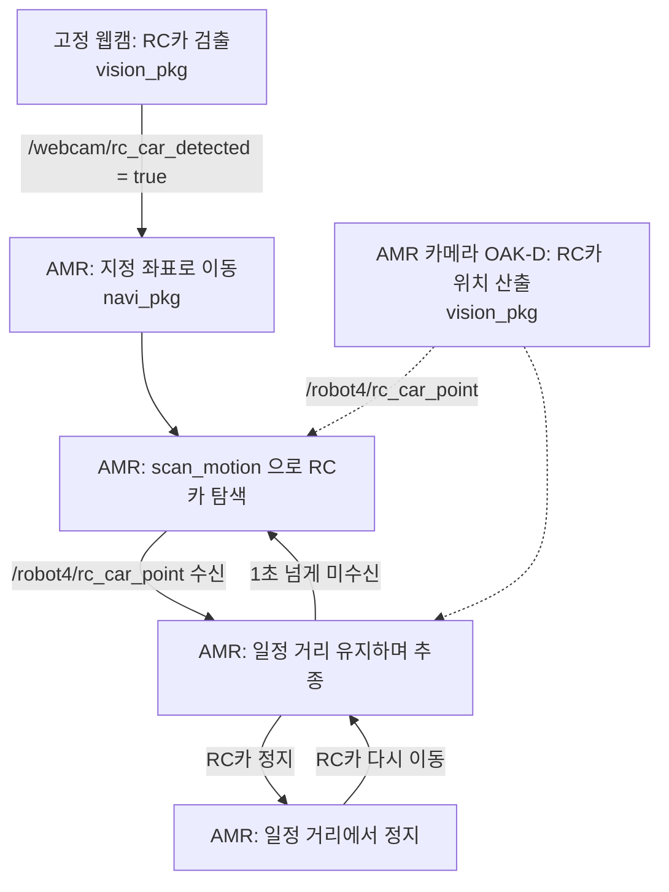

# 인터페이스 정의 (초안 v0.1, 2026-10-06)

`vision_pkg` 와 `navi_pkg` 가 주고받는 토픽 약속이다. 새 메시지 타입을 만들지 않고 ROS 기본 메시지만 쓴다.
강의 코드(`to_students` day2·day3)의 방식에 맞췄다. 바꿀 것이 있으면 이 문서를 먼저 고치고 알린다.

## 1. 전체 흐름



## 2. 우리가 정한 토픽 (3개)

| 토픽 | 타입 | 보내는 쪽 | 받는 쪽 |
|---|---|---|---|
| `/webcam/rc_car_detected` | `std_msgs/msg/Bool` | `vision_pkg` (웹캠 노드) | `navi_pkg` |
| `/robot4/rc_car_point` | `geometry_msgs/msg/PointStamped` | `vision_pkg` (AMR 카메라 노드) | `navi_pkg` |
| `/robot4/amr_state` | `std_msgs/msg/String` | `navi_pkg` | `vision_pkg`, 시연 확인용 |

QoS 는 셋 다 기본값(`10`)이다.

### 2.1 `/webcam/rc_car_detected` — 검출 신호

- 고정 웹캠 화면에 RC카가 있으면 `true`, 없으면 `false`.
- **5 Hz 로 계속 보낸다.** 한 번만 보내면 늦게 켠 노드가 놓치기 때문이다.
- 잘못된 검출로 출발하지 않도록, 연속 몇 프레임 검출됐을 때만 `true` 로 바꾸는 것은 `vision_pkg` 가 한다.
- `navi_pkg` 는 `IDLE` 상태에서 처음 `true` 를 받으면 출발하고, 그 뒤 값은 무시한다.

### 2.2 `/robot4/rc_car_point` — RC카 위치

- AMR 카메라(OAK-D)에 RC카가 보이고 깊이 값이 유효할 때(0.2~5.0 m)**만** 보낸다. 최대 5 Hz.
- `header.frame_id = "map"`. `point.x`, `point.y` 가 지도 위 RC카 위치(m)다. `point.z` 는 쓰지 않는다.
  강의 코드 `day3/3_3_d_depth_to_nav_goal_ts.py` 의 "픽셀 + 깊이 → 카메라 좌표 → `map` 변환" 을 그대로 쓴 결과다.
- `header.stamp` 는 그 영상이 찍힌 시각이다.
- **메시지가 오지 않으면 "못 찾음" 이다.** `navi_pkg` 는 마지막 수신 뒤 **1.0 초**가 지나면 놓친 것으로 본다.
- AMR 기준 거리가 필요하면 받는 쪽에서 `tf_buffer.transform(msg, 'base_link')` 로 바꾼다(x 가 전방 거리).

### 2.3 `/robot4/amr_state` — AMR 상태

- 값은 네 가지 문자열 중 하나다. 1 Hz 로 계속 보내고, 바뀌면 바로 한 번 더 보낸다.

| 값 | 뜻 |
|---|---|
| `IDLE` | 검출 신호 대기 |
| `MOVING` | 지정 좌표로 이동 중 |
| `SCANNING` | scan_motion 으로 RC카 탐색 중 |
| `FOLLOWING` | RC카 추종 중 (거리 유지로 멈춰 있는 것도 포함) |

- `vision_pkg` 의 AMR 카메라 노드는 `SCANNING`, `FOLLOWING` 일 때만 추론해도 된다(선택).

## 3. 로봇이 이미 제공하는 것 (그대로 사용)

2026-10-06 `/robot4` 에서 확인한 이름이다. 카메라 토픽 세 개는 강의 코드 기준이라 실제 이름을 한 번 더 확인한다.

| 이름 | 타입 | 쓰는 쪽 |
|---|---|---|
| `/robot4/oakd/rgb/image_raw/compressed` | `sensor_msgs/msg/CompressedImage` | `vision_pkg` |
| `/robot4/oakd/stereo/image_raw` | `sensor_msgs/msg/Image` (깊이, mm) | `vision_pkg` |
| `/robot4/oakd/rgb/camera_info` | `sensor_msgs/msg/CameraInfo` | `vision_pkg` |
| `/robot4/tf`, `/robot4/tf_static` | TF | 둘 다 |
| `/robot4/navigate_to_pose` (액션) | `nav2_msgs/action/NavigateToPose` | `navi_pkg` |
| `/robot4/spin` (액션) | `nav2_msgs/action/Spin` | `navi_pkg` |
| `/robot4/dock`, `/robot4/undock` (액션) | `irobot_create_msgs/action/Dock`, `Undock` | `navi_pkg` |
| `/robot4/cmd_vel` | `geometry_msgs/msg/TwistStamped` | `navi_pkg` |
| `/robot4/amcl_pose` | `geometry_msgs/msg/PoseWithCovarianceStamped` | `navi_pkg` |

`navi_pkg` 는 액션을 직접 부르지 않고 강의에서 쓴 `TurtleBot4Navigator` 로 충분하다:
`dock()`, `undock()`, `setInitialPose()`, `waitUntilNav2Active()`, `getPoseStamped()`, `startToPose()` / `goToPose()`, `spin()`, `isTaskComplete()`, `cancelTask()`.

## 4. 네임스페이스

- 노드 안에서는 토픽 이름을 **앞에 `/` 없이** 쓴다(`rc_car_point`, `amr_state`). 실행할 때 로봇 번호를 준다.
  ```bash
  ros2 run <패키지> <노드> --ros-args -r __ns:=/robot4
  ```
- 고정 웹캠 노드만 로봇에 속하지 않으므로 `/webcam/rc_car_detected` 를 전체 이름으로 쓴다.

## 5. 각 패키지가 정하는 값 (인터페이스 아님)

| 값 | 정하는 쪽 |
|---|---|
| 지정 좌표(지도 x, y, 방향), 유지 거리, scan_motion 방식 | `navi_pkg` |
| YOLO 모델, 검출 기준(신뢰도, 연속 프레임 수) | `vision_pkg` |

## 6. 확인이 필요한 것

- [ ] `/robot4/rc_car_point` 의 좌표계를 `map` 으로 두는 것 (AMR 담당 의견)
- [ ] "놓침" 기준 1.0 초가 추종 제어에 맞는지
- [ ] 초기 위치 설정과 undock 을 `navi_pkg` 가 시작할 때 하는지
- [ ] OAK-D 토픽 실제 이름
