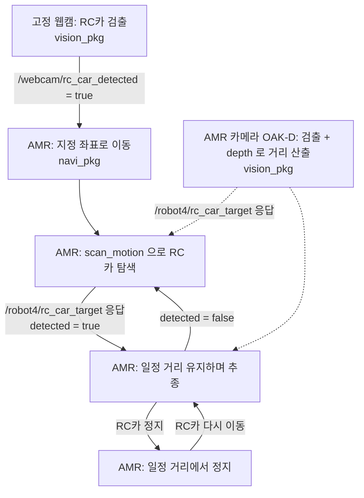

# 인터페이스 정의 (초안 v0.7, 2026-10-06)

`vision_pkg` 와 `navi_pkg` 가 주고받는 토픽·서비스 약속이다. 타입은 `interface_pkg` 의 `msg/`, `srv/` 에 있다.
강의 코드(`to_students` day2·day3)의 방식에 맞췄다. 바꿀 것이 있으면 이 문서를 먼저 고치고 알린다.

## 1. 전체 흐름



## 2. 역할 경계

| 담당 | 하는 일 |
|---|---|
| `vision_pkg` (비전 담당) | **카메라에 관한 것 전부.** 고정 웹캠 검출, AMR 카메라(OAK-D) 검출, depth 로 거리·방향 계산 |
| `navi_pkg` (AMR 담당) | **움직임만.** 시작할 때 초기 위치 설정과 undock, 아래 토픽을 받아 이동, scan_motion, 추종(거리 조절·회전), 정지 |

`navi_pkg` 는 카메라 영상(RGB, depth)을 직접 받지 않는다.

## 3. 우리가 정한 토픽 2개와 서비스 1개

| 토픽 | 타입 | 보내는 쪽 | 받는 쪽 |
|---|---|---|---|
| `/webcam/rc_car_detected` | `interface_pkg/msg/WebcamDetection` | `vision_pkg` (웹캠 노드) | `navi_pkg` |
| `/robot4/rc_car_target` (**서비스**) | `interface_pkg/srv/RcCarTarget` | 응답: `vision_pkg` (AMR 카메라 노드) | 요청: `navi_pkg` |
| `/robot4/amr_state` | `interface_pkg/msg/AmrState` | `navi_pkg` | `vision_pkg`, 시연 확인용 |

토픽 QoS 는 기본값(`10`)이다.

```python
from interface_pkg.msg import WebcamDetection, AmrState
from interface_pkg.srv import RcCarTarget

# 받는 쪽 (navi_pkg)
self.create_subscription(WebcamDetection, '/webcam/rc_car_detected', self.on_detected, 10)

# RC카 거리 묻기 (navi_pkg)
self.target_cli = self.create_client(RcCarTarget, 'rc_car_target')
future = self.target_cli.call_async(RcCarTarget.Request())
rclpy.spin_until_future_complete(self, future, timeout_sec=1.0)
res = future.result()            # None 이면 응답 없음(비전 노드가 꺼져 있음)
if res and res.detected:
    res.distance, res.offset     # 전방 거리(m), 좌우(m)

# 보내는 쪽 (navi_pkg)
self.state_pub = self.create_publisher(AmrState, 'amr_state', 10)
self.state_pub.publish(AmrState(state=AmrState.SCANNING))
```

### 3.1 `/webcam/rc_car_detected` — 검출 신호

- `detected`: 고정 웹캠 화면에 RC카가 있으면 `true`, 없으면 `false`. `header.stamp` 는 영상이 찍힌 시각.
- **5 Hz 로 계속 보낸다.** 한 번만 보내면 늦게 켠 노드가 놓치기 때문이다.
- 잘못된 검출로 출발하지 않도록, 연속 몇 프레임 검출됐을 때만 `true` 로 바꾸는 것은 `vision_pkg` 가 한다.
- `navi_pkg` 는 `IDLE` 상태에서 처음 `true` 를 받으면 출발하고, 그 뒤 값은 무시한다.

### 3.2 `/robot4/rc_car_target` — RC카까지의 거리와 방향 (서비스, depth 결과)

**추종에 쓰는 거리 값을 이 서비스로 묻는다.** `navi_pkg` 는 depth 영상을 직접 받지 않는다. `vision_pkg` 가 OAK-D 의 depth 영상에서 RC카 위치의 깊이를 읽어 거리로 바꿔 두었다가, 요청이 오면 가장 최근 결과를 바로 돌려준다.

- 요청에는 내용이 없다. 응답은 아래와 같다.

| 값 | 뜻 |
|---|---|
| `detected` | 최근 **1.0 초** 안의 영상에서 RC카(`car`)를 찾았고 깊이 값이 유효(0.2~5.0 m)하면 `true` |
| `distance` | RC카까지의 **전방 거리** (m) |
| `offset` | 좌우 치우침 (m). 왼쪽이 +, 오른쪽이 − |
| `header` | `stamp` = 그 영상이 찍힌 시각, `frame_id = "base_link"` |

- `detected` 가 `false` 면 `distance`, `offset` 은 쓰지 않는다. **"놓침" 판단은 `vision_pkg` 가 한다**(1.0 초, 시험하면서 고친다). `navi_pkg` 는 시각을 비교할 필요가 없다.
- `distance`, `offset` 은 **로봇 중심(`base_link`) 기준**이다. 범퍼에서 잰 거리는 로봇 반지름(약 0.17 m)만큼 더 짧다. 유지 거리를 정할 때 이 기준으로 맞춘다.
- 추종은 이 두 값으로 된다: `distance − 유지 거리` 가 0 이 되게 전진·후진하고, `atan2(offset, distance)` 가 0 이 되게 회전한다. RC카가 멈추면 `distance` 가 유지 거리에 머물러 AMR 도 멈춘다. 거리 조절과 회전은 `navi_pkg` 가 한다.
- 영상은 초당 약 10 장 처리된다. 그보다 자주 물어도 같은 값이 온다.
- scan_motion 중에는 `detected` 가 `true` 가 될 때까지 반복해서 묻는다.
- **주의:** 구독 콜백이나 타이머 콜백 **안에서** `spin_until_future_complete` 를 부르면 멈춘다. 콜백 안에서는 `call_async` 뒤 `future.add_done_callback(...)` 을 쓴다. `TurtleBot4Navigator` 를 쓰는 순서형 코드(`main` 안의 `while` 루프)에서는 위 예시 그대로 쓰면 된다.
- 만드는 방법은 강의 코드 `day3/3_3_d_depth_to_nav_goal_ts.py` 와 같다(픽셀 + 깊이 → 카메라 좌표 → TF 변환). 변환 대상만 `map` 대신 `base_link` 다.

### 3.3 `/robot4/amr_state` — AMR 상태

- `state` 는 네 가지 문자열 중 하나다. 직접 쓰지 말고 `AmrState.IDLE` 같은 상수를 쓴다. 1 Hz 로 계속 보내고, 바뀌면 바로 한 번 더 보낸다.

| 값 | 뜻 |
|---|---|
| `IDLE` | 검출 신호 대기 |
| `MOVING` | 지정 좌표로 이동 중 |
| `SCANNING` | scan_motion 으로 RC카 탐색 중 |
| `FOLLOWING` | RC카 추종 중 (거리 유지로 멈춰 있는 것도 포함) |

- `vision_pkg` 의 AMR 카메라 노드는 `SCANNING`, `FOLLOWING` 일 때만 추론해도 된다(선택).

## 4. 로봇이 이미 제공하는 것 (그대로 사용)

2026-10-06 `/robot4` 에서 확인한 이름이다. 카메라 토픽 이름은 강의 코드와 같다.

| 이름 | 타입 | 쓰는 쪽 |
|---|---|---|
| `/robot4/oakd/rgb/image_raw/compressed` | `sensor_msgs/msg/CompressedImage` | `vision_pkg` |
| `/robot4/oakd/stereo/image_raw` | `sensor_msgs/msg/Image` (**depth**, 값 단위 mm) | `vision_pkg` |
| `/robot4/oakd/rgb/camera_info` | `sensor_msgs/msg/CameraInfo` | `vision_pkg` |
| `/robot4/tf`, `/robot4/tf_static` | TF | 둘 다 |
| `/robot4/navigate_to_pose` (액션) | `nav2_msgs/action/NavigateToPose` | `navi_pkg` |
| `/robot4/spin` (액션) | `nav2_msgs/action/Spin` | `navi_pkg` |
| `/robot4/dock`, `/robot4/undock` (액션) | `irobot_create_msgs/action/Dock`, `Undock` | `navi_pkg` |
| `/robot4/cmd_vel` | `geometry_msgs/msg/TwistStamped` | `navi_pkg` |
| `/robot4/amcl_pose` | `geometry_msgs/msg/PoseWithCovarianceStamped` | `navi_pkg` |

`navi_pkg` 는 액션을 직접 부르지 않고 강의에서 쓴 `TurtleBot4Navigator` 로 충분하다:
`dock()`, `undock()`, `setInitialPose()`, `waitUntilNav2Active()`, `getPoseStamped()`, `startToPose()` / `goToPose()`, `spin()`, `isTaskComplete()`, `cancelTask()`.

## 5. 네임스페이스

- 노드 안에서는 토픽·서비스 이름을 **앞에 `/` 없이** 쓴다(`rc_car_target`, `amr_state`). 실행할 때 로봇 번호를 준다.
  ```bash
  ros2 run <패키지> <노드> --ros-args -r __ns:=/robot4
  ```
- 고정 웹캠 노드만 로봇에 속하지 않으므로 `/webcam/rc_car_detected` 를 전체 이름으로 쓴다.

## 6. 각 패키지가 정하는 값 (인터페이스 아님)

| 값 | 정하는 쪽 |
|---|---|
| 지정 좌표(지도 x, y, 방향), 유지 거리, scan_motion 방식 | `navi_pkg` |
| YOLO 모델, 검출 기준(신뢰도, 연속 프레임 수) | `vision_pkg` |

## 7. 확인이 필요한 것

- [ ] "놓침" 기준 1.0 초(`vision_pkg` 안의 값) — 통합 시험 때 조정
- [ ] OAK-D 영상이 실제로 들어오는지 (10/6 에는 토픽 이름만 확인, 영상은 수신되지 않음)
